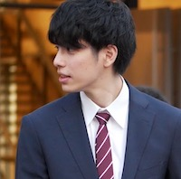

Cloud Support Engineer @ Amazon Web Services Japan G.K.
- Premium technical support for AWS services (especially EC2, EBS, Linux, ElastiCache, EFS, etc...).
- Subject Matter Expert (SME) of AWS internal accreditation on EC2 Core.
- Hiring and training other support engineers.
- Maintainer of softwares.
	- [dynein (DynamoDB CLI written in Rust)](https://github.com/awslabs/dynein)
	- Internal tools

---

## Interest Areas
- Low-layer programming (OS, CPU, etc...)
- OSS contribution
	- [Commits to linux kernel](https://git.kernel.org/pub/scm/linux/kernel/git/torvalds/linux.git/log/?qt=grep&q=Takahiro+Itazuri)
	- [Commits to dynein](https://github.com/awslabs/dynein/commits/main?author=itazur)
- Machine Learning (Adversarial Examples) & Computer Vision

---

## Skills
### Programming Languages
- Rust
- C++
- C
- Assembly (x86)
- JavaScript
- Python

### Technical Skills
- Linux (toubleshooting, system administratioon, etc...)
- PyTorch
- OpenCV

### Certifications
- [Fundamental Information Technology Engineer Examination](https://www.jitec.ipa.go.jp/2_01english/02examcategories.html)
- [Applied Information Technology Engineer Examination](https://www.jitec.ipa.go.jp/2_01english/02examcategories.html)
- [AWS Certified Solutions Architect - Associate](https://aws.amazon.com/certification/certified-solutions-architect-associate/)

---

## Biography
#### 2021.09 - Present &nbsp; Cloud Support Engineer II @ Amazon Web Services Japan G.K.
- Premium technical support for AWS services (EC2, EBS, Linux, ElastiCache, EFS, etc...).
- Subject Matter Expert (SME) of AWS internal accreditation on EC2 Core.
- Hiring and training other support engineers.
- Maintainer of softwares.
	- [dynein (DynamoDB CLI written in Rust)](https://github.com/awslabs/dynein)
	- Internal tools

#### 2020.06 - 2021.09 &nbsp; Cloud Support Engineer I @ Amazon Web Services Japan G.K.
- Premium technical support for AWS services (EC2, EBS, Linux, ElastiCache, EFS, etc...).
- Subject Matter Expert (SME) of AWS internal accreditation on EC2 Core.

#### 2019.08 - 2020.05 &nbsp; Cloud Support Associate II @ Amazon Web Services Japan G.K.
- Premium technical support for AWS services (EC2, EBS, Linux, ElastiCache, EFS, etc...).

#### 2019.04 - 2019.08 &nbsp; Cloud Support Associate I @ Amazon Web Services Japan G.K.
- Premium technical support for basic AWS services (EC2, EBS, ELB, VPC, Route 53, S3, IAM, CloudFront, RDS, etc...).

#### 2018.08 - 2018.12 &nbsp; Research Internship @ [FOVE Inc.](https://fove-inc.com/)
- Research theme: Video Sementic Segmentation

#### 2017.06 - 2018.03 &nbsp; [IPA Exploratory IT Human Resource Project (MITOU Program)](https://www.ipa.go.jp/english/humandev/third.html)
- Project title: [Software to improve sports skills enjoyably with music](https://www.ipa.go.jp/jinzai/mitou/2017/gaiyou_ig-2.html)
- Features:
	 - [Sonify](https://en.wikipedia.org/wiki/Data_sonification) body movement in real-time with smart-phone.
	 - Recommend songs which match the beat with body movement.
- Final presentation: [YouTube](https://www.youtube.com/watch?v=3AcnrROn8rk)

#### 2017.04 - 2019.03 &nbsp; Master of Engineering @ Waseda University
- Belonging: [Morhishima Lab.](http://www.mlab.phys.waseda.ac.jp/?lang=en), [Department of Pure and Applied Physics](http://www.phys.waseda.ac.jp/), Graduate School of Advanced Science and Engineering
- GPA: TBC

#### 2013.04 - 2017.03 &nbsp; Bachelor of Science @ Waseda University
- Belonging: [Morhishima Lab.](http://www.mlab.phys.waseda.ac.jp/?lang=en), [Department of Physics](http://www.phys.waseda.ac.jp/), School of Advanced Science and Engineering
- GPA: TBC

---

## Links
- GitHub
	- For personal use: [zulinx86](https://github.com/zulinx86)
	- For business use: [itazur](https://github.com/itazur)
- [Twitter](https://twitter.com/zulinx86)
- [LinkedIn](https://www.linkedin.com/in/takahiro-itazuri-b6567b148/)
- [AtCoder](https://atcoder.jp/users/zulinx86)

