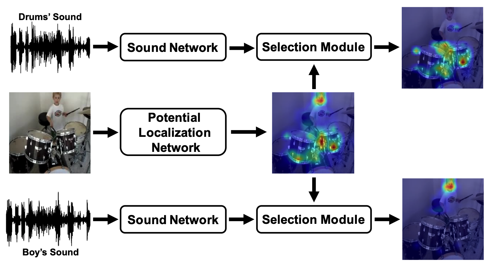
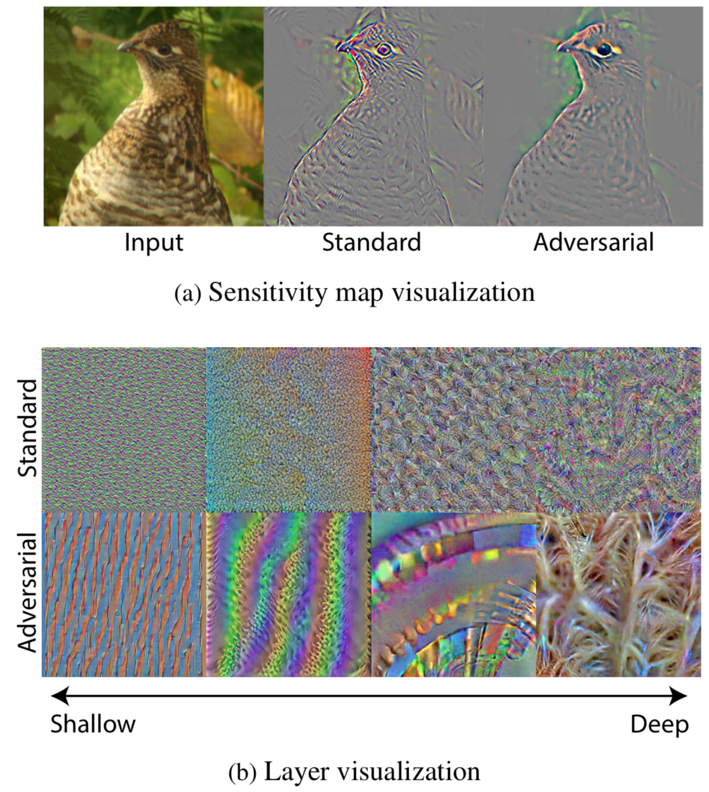
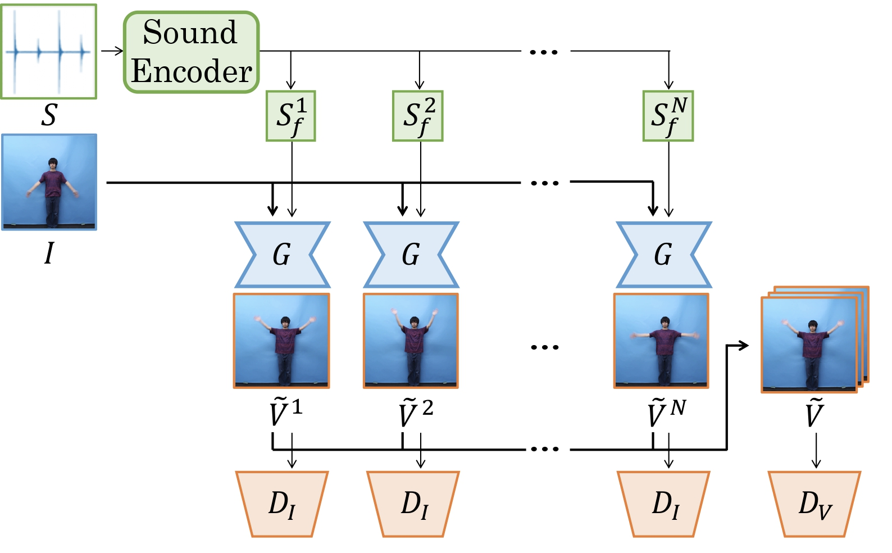
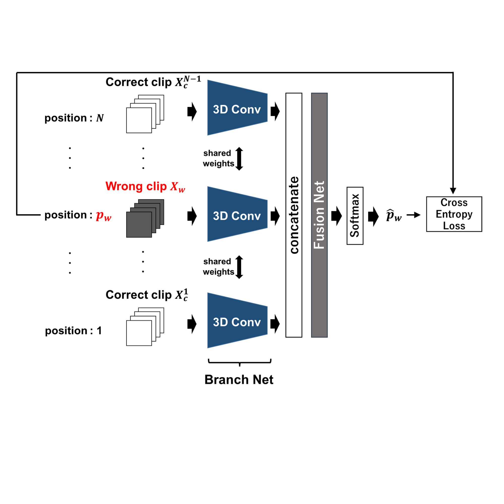
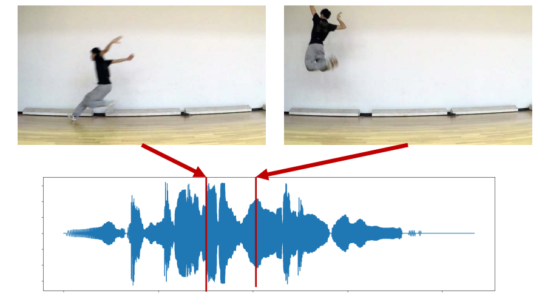
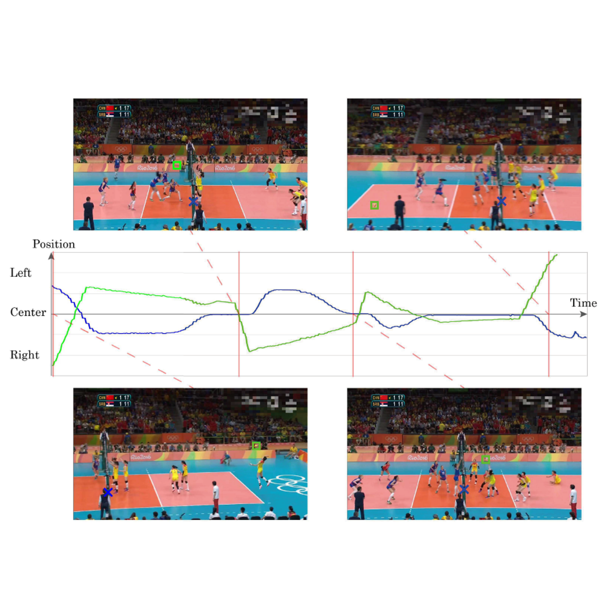

## Projects
<table>
	<tr>
		<td>
			
		</td>
		<td>
			<h3>Do We Need Sound for Sound Source Localization?</h3>
			Takashi Ohya, Shohei Iwase, Ryota Natsume, <b>Takahiro Itazuri</b>, Shugo Yamaguchi, and Shigeo Morishima 
			@ Asian Conference on Computer Vision 2020 (ACCV 2020) 
			<a href="https://openaccess.thecvf.com/content/ACCV2020/papers/Oya_Do_We_Need_Sound_for_Sound_Source_Localization_ACCV_2020_paper.pdf">[paper]</a>
		</td>
	</tr>
	<tr>
		<td>
			
		</td>
		<td>
			<h3>What Do Adversarially Robust Models Look At?</h3>
			<b>Takahiro Itazuri</b>, Yoshihiro Fukuhara, Hirokatsu Kataoka, and Shigeo Morishima 
			<a href="https://arxiv.org/abs/1905.07666">[paper]</a>
		</td>
	</tr>
	<tr>
		<td>
			
		</td>
		<td>
			<h3>Generating Video from Single Image and Sound</h3>
			Yukitaka Tsuchiya, <b>Takahiro Itazuri</b>, Ryota Natsume, Shintaro Yamamoto, Takuya Kato, and Shigeo Morishima 
			@ Computer Vision and Pattern Recognition Workshop 2019 (CVPRW 2019) 
			<a href="http://openaccess.thecvf.com/content_CVPRW_2019/papers/Sight%20and%20Sound/Yukitaka_Tsuchiya_Generating_Video_from_Single_Image_and_Sound_CVPRW_2019_paper.pdf">[paper]</a><a href="https://youtu.be/nNjLzcdt_xE">[video]</a>
		</td>
	</tr>
	<tr>
		<td>
			
		</td>
		<td>
			<h3>Learning Spatiotemporal 3D Convolution with Video Order Self-Supervision</h3>
			Tomoyuki Suzuki, <b>Takahiro Itazuri</b>, Kensho Hara, and Hirokatsu Kataoka 
			@ European Conference on Computer Vision Workshop 2018 (ECCVW 2018) 
			<a href="https://openaccess.thecvf.com/content_ECCVW_2018/papers/11130/Suzuki_Learning_Spatiotemporal_3D_Convolution_with_Video_Order_Self-Supervision_ECCVW_2018_paper.pdf">[paper]</a>
		</td>
	</tr>
	<tr>
		<td>
			
		</td>
		<td>
			<h3>Movement Sonification for Motor Learning</h3>
			<b>Takahiro Itazuri</b>, Tsukasa Fukusato, and Shigeo Morishima 
			@ IPA Exploratory IT Human Resource Project (MITOU Program 2017) 
			<a href="https://youtu.be/3AcnrROn8rk">[video]</a>
		</td>
	</tr>
	<tr>
		<td>
			
		</td>
		<td>
			<h3>Court-based Volleyball Video Summarization Focusing on Rally Scene</h3>
			<b>Takahiro Itazuri</b>, Tsukasa Fukusato, Shugo Yamaguchi, and Shigeo Morishima 
			@ Computer Vision and Pattern Recognition Workshops 2017 (CVPRW 2017) 
			<a href="https://openaccess.thecvf.com/content_cvpr_2017_workshops/w2/papers/Itazuri_Court-Based_Volleyball_Video_CVPR_2017_paper.pdf">[paper]</a>
		</td>
	</tr>
</table>

## Publications
### Full Papers
1. Takashi Oya, Shohei Iwase, Ryota Natsume, **Takahiro Itazuri**, Shugo Yamaguchi, and Shigeo Morishima, "Do We Need Sound for Sound Source Localization?", Computer Vision - ACCV 2020, pp.119-136, 2020. [[paper]](https://openaccess.thecvf.com/content/ACCV2020/papers/Oya_Do_We_Need_Sound_for_Sound_Source_Localization_ACCV_2020_paper.pdf)
1. Tomoyuki Suzuki, **Takahiro Itazuri**, Kensho Hara, and Hisokatsu Kataoka, "Learning Spatiotemporal 3D Convolution with Video Order Self-Supervision", the 1st Person In Context Workshop (PIC) at ECCV 2018, pp.590-598, 2018. [[paper]](https://openaccess.thecvf.com/content_ECCVW_2018/papers/11130/Suzuki_Learning_Spatiotemporal_3D_Convolution_with_Video_Order_Self-Supervision_ECCVW_2018_paper.pdf)
1. **Takahiro Itazuri**, Tsukasa Fukusato, Shugo Yamaguchi, and Shigeo Morishima, "Court-based Volleyball Video Summarization Focusing on Rally Scene", In Proceedings of the 3rd IEEE International Workshop on Computer Vision in Sports (CVSports) at CVPR 2017, pp.123-130, 2017. [[paper]](https://openaccess.thecvf.com/content_cvpr_2017_workshops/w2/papers/Itazuri_Court-Based_Volleyball_Video_CVPR_2017_paper.pdf)

### Poster Presentations
1. Tsuchiya Yukitaka, **Takahiro Itazuri**, Ryota Natsume, Shintaro Yamamoto, Takuya Kato, and Shigeo Morishima, "Generating Video from Single Image and Sound", In Sight and Sound Workshop at CVPR 2019, 2019. [[paper]](http://openaccess.thecvf.com/content_CVPRW_2019/papers/Sight%20and%20Sound/Yukitaka_Tsuchiya_Generating_Video_from_Single_Image_and_Sound_CVPRW_2019_paper.pdf)
1. **Takahiro Itazuri**, Tsukasa Fukusato, Shugo Yamaguchi, and Shigeo Morishima, "Court-Aware Volleyball Video Summarization", ACM SIGGRAPH 2017, No.74, 2017. [[paper]](https://dl.acm.org/doi/10.1145/3102163.3102204)

### arXiv Papers
1. **Takahiro Itazuri**, Yoshihiro Fukuhara, Hirokatsu Kataoka, and Shigeo Morishima, "What Do Adversarially Robust Models Look At?", arXiv:1905.07666, 2019. [[paper]](https://arxiv.org/abs/1905.07666)

